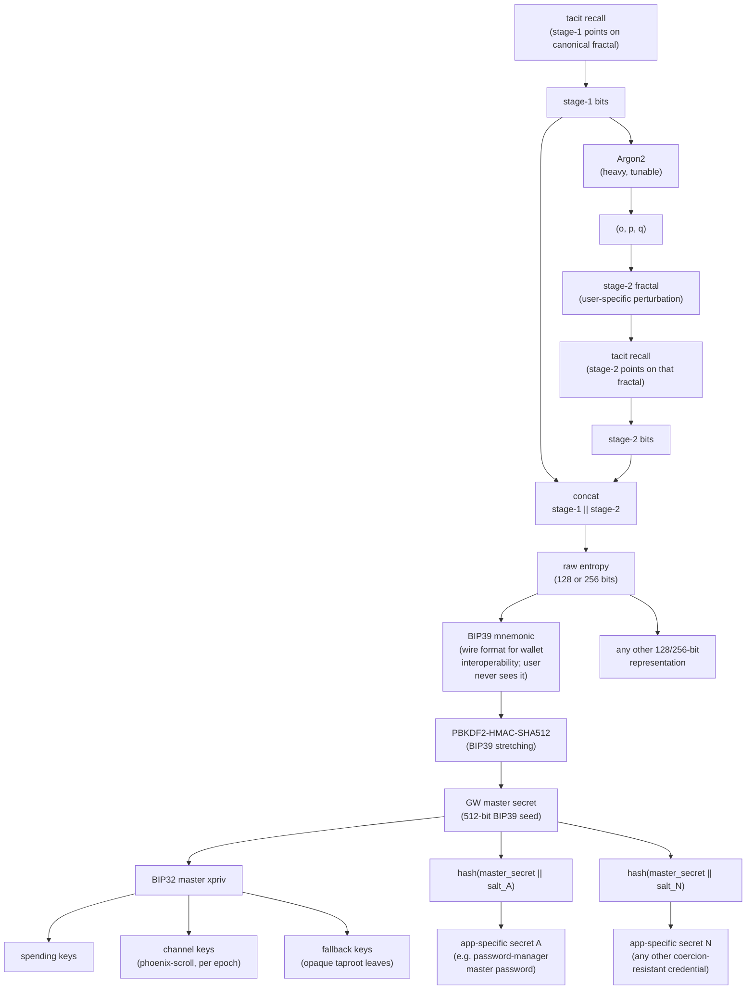

# Great Wall Ecosystem — Multi-Repo Architecture

This document describes the repository structure, dependency graph,
naming conventions, cryptographic design, security model, and
inheritance protocol of the Great Wall ecosystem. It is written for
**collaborators and auditors**.

For an end-user overview of what Great Wallet is and how it is used,
see [README.md](./README.md).

---

## Overview

The ecosystem consists of seven repositories. Six are **libraries**
(no submodules, no dependencies on each other at the git level) and
one is the **app** that integrates everything. The naming blends
Chinese cultural motifs with a phoenix sub-theme for inheritance.

| # | Repo                        | Motif                      | Role                                      | Status          |
|---|-----------------------------|----------------------------|-------------------------------------------|-----------------|
| 1 | **great-wall-core**         | The Wall                   | Fractal encoder engine (Rust + Python)    | Beta (public)   |
| 2 | **tlp-core**                | (utility)                  | RSW time-lock puzzle library              | In development  |
| 3 | **great-wall-ux**           | The Wall's appearance      | Rendering, palettes, interaction, effects | In development  |
| 4 | **celestial-peace-nf-core** | Gate of Celestial Peace    | Spaced-repetition training logic (Anki)   | In development  |
| 5 | **jade-clock**              | Imperial timekeeping       | LN marketplace client for TLP solving     | In development  |
| 6 | **phoenix-scroll**          | Phoenix rebirth            | Inheritance protocol (LN + taproot)       | In development  |
| 7 | **great-wallet**            | Wall + wallet (pun)        | Unified end-user app                      | In development  |

Only `great-wall-core` is currently public. Everything marked
*In development* is non-public work-in-progress and may change
substantially before first release.

---

## Naming Conventions

- **Great Wall** — the core cryptographic system. Coercion-resistant
  seed storage via fractal encoding + Argon2 time-gating.
- **Celestial Peace: Never Forget (CPNF)** — the training companion.
  Named after the Gate of Celestial Peace (Tiananmen). The "NF" suffix
  ("Never Forget") avoids the cursed acronym "CP".
- **Jade Clock** — the Lightning Network marketplace for anonymous
  TLP-solving. Named after the jade clepsydra (ancient Chinese water
  clock). Chosen for brevity (2 syllables) so it combines cleanly with
  qualifiers: "Jade Clock client", "Jade Clock server",
  "Jade Clock market".
- **Phoenix Scroll** — the inheritance protocol. The phoenix's
  death-and-rebirth cycle mirrors the rotation mechanism (each
  rotation is a small rebirth; cessation triggers true succession).
  The scroll is the testament the phoenix carries across generations.
  Combines cleanly: "Phoenix Scroll channel", "Phoenix Scroll
  protocol", "Phoenix Scroll watchtower".
- **Great Wallet** — the unified app. A pun on Great Wall + wallet.

---

## Dependency Graph

```
great-wall-core          (no submodules)
tlp-core                 (no submodules)
great-wall-ux            (no submodules)
celestial-peace-nf-core  (no submodules)
jade-clock               (no submodules)
phoenix-scroll           (no submodules)

great-wallet             (six submodules, flat, plus its own app/ source tree —
                          the only repo with submodules)
  great-wall-core/          <- submodule
  tlp-core/                 <- submodule
  great-wall-ux/            <- submodule
  celestial-peace-nf-core/  <- submodule
  jade-clock/               <- submodule
  phoenix-scroll/           <- submodule
  app/                      (not a submodule: great-wallet's own UI / orchestration)
```

### Submodule Rules

1. **Only the app repo (great-wallet) has submodules.** Library repos
   have zero submodules.
2. **No nested submodules.** Ever. All submodules in great-wallet are
   flat (one level deep).
3. **Version pinning is the app's responsibility.** great-wallet pins
   each library to a specific commit hash. Libraries declare
   dependencies on each other at the import/build level, but
   great-wallet ensures all six are at compatible versions.
4. **Libraries may depend on each other at the API level** (e.g.,
   great-wall-ux imports from great-wall-core, celestial-peace-nf-core
   imports from tlp-core) but never via submodules — the consuming app
   provides all libraries.

### Dependency Matrix

Which libraries does each library import from?

| Library                  | Imports from                          |
|--------------------------|---------------------------------------|
| great-wall-core          | (none)                                |
| tlp-core                 | (none)                                |
| great-wall-ux            | great-wall-core                       |
| celestial-peace-nf-core  | great-wall-core, tlp-core             |
| jade-clock               | tlp-core                              |
| phoenix-scroll           | tlp-core                              |

---

## Two-Stage Pipeline

Great Wall's fractal encoder operates in two sequential stages. The
two-stage split is what gives the system its defense-in-depth
properties and underlies the vocabulary (*stage-1 bits*, *stage-2
fractal*, *o, p, q*) used throughout this document.

### Stage 1 — canonical fractal

- **Fractal used:** the canonical Burning Ship fractal. Its parameters
  are fixed constants of the protocol; no stored state is needed to
  render it.
- **Input from the user:** tacit recall of the stage-1 locations the
  user learned at setup.
- **Output:** *stage-1 bits*, a user-derived share of entropy
  extracted by decoding the user-identified points through the
  bisection algorithm.
- **Offline-reproducible:** yes. The user (and only the user) can
  reconstruct stage-1 bits from memory alone, on any machine, without
  any stored data.

Because stage-1 uses the canonical fractal, stage-1 bits are the
entry point: every downstream secret — the stage-2 fractal's
perturbation parameters, vault keys, inheritance keys — is gated by
them.

### Stage 2 — perturbed fractal

- **Fractal used:** a user-specific *perturbation* of the Burning
  Ship fractal, parameterised by three numbers `(o, p, q)`. A
  different `(o, p, q)` produces a visually different landscape, so
  stage-2 is personal to each user.
- **Where `(o, p, q)` comes from:** `(o, p, q) = Argon2(stage-1 bits)`.
  The perturbation parameters are the deterministic output of a
  heavy Argon2 pass keyed by stage-1 bits. They are not memorised,
  and in regular operation are never shown to the user — they exist
  only as ephemeral state inside the app during a rendering session.
  Argon2's intentional slowness is what makes *rendering the stage-2
  fractal at all* a gated operation.
- **Input from the user:** tacit recall of the stage-2 locations the
  user learned at setup, rendered on that perturbed fractal.
- **Output:** *stage-2 bits*, which combined with stage-1 bits give
  the full BIP39 entropy (see *Key Derivation* below).

### How the two stages lock together

- **Vault as TLP-gated shortcut, not a primary store.** Without
  stage-1 recall, the Argon2 pre-image is unavailable, so
  `(o, p, q)` cannot be computed and the stage-2 fractal cannot
  even be rendered — let alone solved. `celestial-peace-nf-core`'s
  **vault** holds the already-computed `(o, p, q)`, the encoded
  stage-2 points, and the SM-2 scheduler state, encrypted under a
  key derived from stage-1 bits and sealed with an RSW time-lock
  puzzle (TLP). A legitimate user who has lost the vault can always
  fall back to Argon2 re-derivation from memory; the vault is a
  time-discounted shortcut for returning users, never the root of
  trust.
- **An attacker learns nothing from the vault.** They face both the
  stage-1 recall barrier (tacit, non-transmissible) and, on top of
  it, the TLP delay.

Sealing the vault with an RSW TLP — as opposed to any coarser
time-lock — buys four properties that are hard to replicate with any
other primitive:

1. **Per-session tunable security/convenience trade-off.** Each
   time the user exits a practice session, they choose the TLP
   duration for the *next* session: shorter if they expect to come
   back soon, longer if they want more time-cost to stand between
   an attacker and the vault until then. The trade-off is dialled
   afresh at every session boundary.

2. **Exact-fit spaced-repetition gating.** SM-2 dictates precise
   review intervals (hours, days, weeks, months). Because RSW TLP
   *setup* is O(1) in the chosen delay, the vault's seal can be
   dialled to exactly match the next scheduled review — no
   rounding down for crypto convenience, no bolted-on minimum
   duration. The training phase therefore runs at the theoretical
   maximum security SM-2 allows for.

3. **Paid time-barrier resolution without loss of self-custody.**
   RSW TLP solving is outsourceable: the `jade-clock` marketplace
   can solve the puzzle on the user's behalf for a Lightning
   payment. The TLP-gated ciphertext — the vault itself — never
   leaves the user's device. What the marketplace receives is only
   the TLP *setup*: the operand to be repeatedly squared and the
   RSW modulus `N`. It returns the raw solution and learns nothing
   about what that solution unlocks (or about the user's identity).
   The user gets time back without giving up custody.

4. **Integrity-checkable computation via milestones.** An RSW TLP
   solution is a long chain of iterative modular squarings:
   `x, x², x⁴, …, x^(2^t)`. At setup time — while φ(n) is still
   known — the puzzle constructor can cheaply (O(1)) precompute a
   digest of the intermediate value `x^(2^k)` at any chosen `k`.
   These **milestones** are kept private to the client; they are
   never shared with the solver. The client checks them offline
   after the solver returns. If a milestone disagrees with the
   delivered result, the client has self-contained evidence of the
   discrepancy — the original request `(N, x, t)`, the expected
   milestone digest, and the obtained result — which it presents
   to an arbiter to adjudicate whether the solver cheated,
   whether the client is repudiating honest work, or whether a
   computation error occurred mid-solve. No party has to re-run
   the full t-squaring to resolve the dispute.

   In effect, `M` milestones slice a single t-squaring puzzle into
   `M` sub-puzzles of `t/M` squarings each, diluting risk for both
   sides: any dispute localises to one segment (only that segment
   needs arbitration), and payments can be staged per milestone so
   neither client nor solver is ever exposed for more than `1/M`
   of the job at a time.

### Calibrating Argon2 duration

Argon2's target runtime is a convenience-vs.-coercion-resistance
knob, not a protocol constant. The longer it takes to derive
`(o, p, q)` from stage-1 bits, the longer any attacker who has
somehow obtained stage-1 bits must still wait before they can
render the stage-2 fractal and complete decryption — but the longer
the legitimate user also waits on any fallback re-derivation from
memory.

Two useful calibration points, benchmarked against the real-world
physical-attack incidents compiled by Jameson Lopp in
[jlopp/physical-bitcoin-attacks](https://github.com/jlopp/physical-bitcoin-attacks/):

- **A few hours** is already enough to defeat common robbery and
  flash kidnapping: an attacker who has to hold a victim captive
  for the full Argon2 delay to complete a single derivation is
  forced into a much longer — and more detectable — encounter than
  those attack patterns support.
- **About one week** defeats even the flashiest published wrench
  attacks. For calibration, the ~2-day kidnapping of David Balland
  in January 2025 — one of the most protracted attacks in Lopp's
  compilation — would fall well inside a one-week Argon2 window,
  and longer hostage situations become physically and operationally
  untenable for most attackers.

There is no protocol upper bound. The user picks a duration that
matches their threat model and their tolerance for waiting on
fallback re-derivation. The Argon2 target also sets the useful
ceiling on training-vault TLP durations — a vault sealed with a TLP
longer than Argon2 adds no protection, since anyone in possession
of stage-1 bits could just re-derive via Argon2 in less time —
while inheritance and acceleration use TLPs on their own independent
schedules (see the *Inheritance Protocol* section).

### Determinism guarantees

All stage-1 and stage-2 encoding/decoding paths must be bit-exact
across platforms, compilers, and releases. Any drift in the bisection
algorithm, PRNG, contraction arithmetic, or BFS neighbor order breaks
the bijection and invalidates existing encodings.

This is why `great-wall-core`'s determinism-critical code lives in
Rust and uses a custom **I4F60** fixed-point type instead of floating
point.

- **I4F60** is a 64-bit signed fixed-point format laid out as **1
  sign bit + 3 integer bits + 60 fractional bits**.
- It represents values in the half-open interval **[-8, +8)** with
  uniform precision **2⁻⁶⁰** (≈ 8.67 × 10⁻¹⁹).
- The tight range is deliberate: the Burning Ship fractal's
  non-escape region fits well within this box, and the narrower
  range buys more fractional bits — and therefore more precision —
  than a wider signed type of the same width would.
- Unlike IEEE-754 floats, I4F60 arithmetic has no platform-dependent
  rounding modes, no denormals, and no NaNs; results depend only on
  the input bit patterns and the specified operation, which is
  exactly what the bijection requires.

---

## Key Derivation

Every coercion-resistant secret in the Great Wall ecosystem —
spending keys, inheritance channel keys, vault keys, fallback
addresses, and any application-specific secret the user cares to
protect — is derived from a single user-held root whose entropy
is held only as tacit fractal recall.



### Notes on the representation

- **BIP39 is a wire format, not the secret.** The mnemonic exists
  so the result can be pasted into any standard BIP39 wallet
  unchanged. It is the same entropy as the raw `stage-1 ||
  stage-2` bits, just in a human-readable encoding. The user never
  sees it either.
- **Derivation of non-Bitcoin secrets is built in.** `great-wall-core`
  already implements `hash(master_secret || salt)`-style derivation
  so that additional coercion-resistant secrets — passwords,
  signing keys, encryption keys for other systems — can be derived
  from the same fractal recall without rotating the fractal.
  Domain separation is by salt. A natural example is a master
  password for an off-the-shelf password manager: a single salted
  digest such as `hash(master_secret || "password-manager/v1")`
  yields a high-entropy string the user can paste into the
  manager's unlock field and never has to memorise — the manager
  itself keeps per-site credentials, and the one string that gates
  them inherits Great Wall's coercion-resistance for free.

### Invariants

- **The master secret is never shown to the user.** Raw entropy,
  mnemonic, 512-bit seed, xpriv, and all derived keys exist only as
  ephemeral state inside the app during a recall session.
  Memorising any explicit part would turn that part into
  verbalizable knowledge — coercible, and therefore outside TKBA's
  protection.
- **Setup is a write-only operation on the user's memory.** At
  setup the app generates a fresh entropy root, encodes it onto
  the user's fractal, then destroys the plaintext. The user leaves
  setup with tacit recall only — there is no mnemonic backup to
  write down, and none to lose.
- **Every participant should be a full GW user.** Testator, heirs, 
  and cascading heirs each can and should have their own independent
  fractal and entropy root. This keeps every leaf of the inheritance
  tree equally coercion-resistant: coercing any one party does not
  weaken anyone else's custody, and a successful inheritance event
  does not downgrade the security of the funds that pass through
  it.
- **All downstream keys are stateless.** Channel keys are derived
  deterministically from `(master_secret, derivation path, epoch
  number)`. Vault keys are derived from stage-1 bits.
  Application-specific secrets are derived from
  `(master_secret, salt)`. No derived key is ever stored long-term;
  losing a device loses no secrets.

---

## Repo Descriptions

### 1. great-wall-core

**Status:** Beta (public).

**The fractal encoder engine.** Bijective mapping between BIP39 mnemonic
seeds and Burning Ship fractal locations, with Argon2-based two-stage
pipeline. All determinism-critical computation is in Rust (I4F60
fixed-point arithmetic). Python FFI bridge via ctypes.

Key contents:
```
burning_ship/
  rust_engine/              Rust core (fractal, bisection, Argon2)
  burning_ship_engine.py    Python ctypes bridge
  bip39.py                  BIP39 mnemonic <-> bit conversion
  constants.py              Configuration, size presets
  encoding.py               BIP39 <-> fractal encode/decode orchestration
```

This repo must be treated with extreme care. Any change to the
bisection algorithm, PRNG, contraction arithmetic, or BFS neighbor
order breaks the deterministic bijection and invalidates all existing
encodings.

### 2. tlp-core

**Status:** In development.

**RSW time-lock puzzle library.** Pure cryptographic utility — no
dependency on any other repo in the ecosystem.

Responsibilities:
- RSA modulus generation
- TLP encryption (fast path via phi(n))
- TLP solving (sequential repeated squaring)
- Solution verification
- Puzzle serialization format
- Device speed calibration (squarings/sec measurement)

Why RSW TLP and not Argon2 for this role: RSW TLP allows for instant O(1) 
setup of puzzle of arbitrary time difficulty to cryptographically gate an
existing key, while numerous Argon2 iterations impose time for 
deterministic key derivation.

### 3. great-wall-ux

**Status:** In development.

**Rendering, palettes, and interaction layer.** Separated from
great-wall-core so that visual polish (color schemes, lighting effects,
leaf-area highlighting) and porting to different platforms/frameworks
does not touch the engine.

Responsibilities:
- Fractal rendering (viewport, zoom, pan)
- Color schemes and escape-count transforms
- Bisection area visualization (gated by debug mode, since this is 
  explicit knowledge whose memorization undermines TKBA) 
- Point markers and crosshairs
- Input handling (pointer, keyboard, touch, gamepad)
- Platform abstraction for portability — **desktop first, mobile
  next, web further ahead** — implemented as a single Dart + Flutter
  codebase. The pygame viewer in `great-wall-core` is treated as a
  reference implementation only and is not carried into the
  library's first tagged release. See
  `great-wall-ux/TECH_STACK.md` for the full rationale and locked
  sub-decisions (web renderer, threading model, platform floors,
  FFI strategy, back-pressure, palette pipeline, accessibility,
  internationalisation, and the coercion-resistance invariants the
  library is built against).

Imports from great-wall-core at the API level (calls the Rust engine
for escape counts, encode/decode). Does NOT submodule great-wall-core —
the consuming app provides both.

### 4. celestial-peace-nf-core

**Status:** In development.

**Spaced-repetition training logic.** Implements the "Celestial Peace:
Never Forget" training system that helps users consolidate tacit memory
of their fractal locations.

Responsibilities:
- SM-2 spaced repetition scheduler (Anki-like)
- Practice session orchestration and grading
- Vault format (serialization of stage-2 parameters, encoded points,
  scheduler state)
- Vault encryption/decryption (via tlp-core)
- Background TLP solver management with checkpointing

#### Core Concept

The user needs to practice recalling their fractal locations to
consolidate tacit memory. Between practice sessions, the saved
second-stage data (fractal parameters o, p, q and encoded points) is
encrypted under a TLP whose duration equals the Anki-scheduled interval
until next review.

Key properties:
- **TLP is gated by stage-1 bits.** The user must demonstrate stage-1
  recall (tacit knowledge) to unlock the vault. Without stage-1 bits,
  the vault is unconditionally sealed.
- **TLP duration < Argon2 duration, always.** TLP longer than Argon2
  is pointless because Argon2 re-derivation is always available to
  someone who knows stage-1 bits. TLP provides a time-discounted
  re-entry for legitimate users.
- **TLP duration grows with mastery.** Early sessions use short TLPs
  (hours). As the user's recall improves, intervals lengthen
  (days, weeks). Security of the stored data increases in lockstep
  with the user's decreasing need for it.
- **Graduation = green light.** Once memory consolidation is
  confirmed by the feature, app tells user it's now safe to use system
  to secure stash (risk of loss by forgetting became negligible).
  Regular maintenance reviews are still done following SM-2 doctrine.
- **Inheritance.** Deadlock by death, memory loss, or mental
  incapacitation is still guarded by companion inheritance protocol.

#### Practice Session Flow

```
Background TLP computation completes
  |
  v
App notifies user: "Practice session available"
  |
  v
STAGE 1 RECALL (canonical fractal, no stored data needed)
  User identifies stage-1 points -> decode_full() -> stage-1 bits
  |
  v
Stage-1 bits unlock TLP -> vault decrypted
  |
  v
STAGE 2 RECALL (perturbed fractal using stored o, p, q)
  User identifies stage-2 points -> decode_full() validates
  |
  v
Grade performance -> Anki scheduler -> next interval
  |
  v
New TLP generated (gated by stage-1 bits, new duration)
Vault re-encrypted, cleartext discarded
Begin background TLP computation
```

#### Grading Criteria

| Grade    | Meaning                                    | Effect on interval        |
|----------|--------------------------------------------|---------------------------|
| Again    | Failed to locate one or more points        | Reset to minimum          |
| Hard     | Found points but many attempts / hesitation | Interval x 1.2           |
| Good     | Found points with reasonable confidence    | Interval x ease_factor   |
| Easy     | Identified points immediately              | Interval x ease_factor x 1.3 |

Imports from great-wall-core (encode/decode for validation) and
tlp-core (TLP encrypt/decrypt/solve).

### 5. jade-clock

**Status:** In development.

**Lightning Network marketplace client for anonymous TLP solving.**
Allows users to outsource TLP computation to a marketplace of solvers,
paying via Lightning Network for anonymity.

Responsibilities:
- LN transport layer for marketplace messaging
- TLP job packaging and submission
- Solution retrieval and verification
- Order matching / bid logic
- Anonymity guarantees (onion routing, payment unlinkability)

Imports from tlp-core (TLP format, serialization, verification). Does
NOT depend on great-wall-core — it only needs to understand TLP
puzzles as opaque payloads, not fractal encoding.

Economics (sketch). Jade Clock runs as an anonymous marketplace in
which the marketplace operator also functions as reputation
authority (scoring pseudonymous solvers) and dispute arbiter (see
*How the two stages lock together*, milestone-based dispute
resolution). The default client mode auto-selects a solver by a
lexical ordering over published metrics — price, reputation, ping,
uptime — while advanced modes let the user hand-pick. Full fee
structure, dispute protocol, and reputation-decay details are
deferred.

Note: jade-clock's LN usage is transactional (submit job, pay, get
solution). The inheritance protocol's very different LN usage pattern
(decades-long dedicated channels with custom lockscripts) lives in
phoenix-scroll.

### 6. phoenix-scroll

**Status:** In development.

**Inheritance protocol.** Dead-man's switch bequest mechanism using
dedicated LN channels with TLP-gated lockscripts and recursive taproot
fallback trees. See the "Inheritance Protocol" section below for the
full design.

Responsibilities:
- Dedicated private LN channel management (long epochs, no routing)
- Deterministic channel key derivation from GW master secret
- Rotation logic (dead-man's switch driver)
- TLP-gated commitment transaction construction
- Taproot fallback tree construction (opaque addresses, recursive
  cascading inheritance)
- Heir-side monitoring and claim orchestration
- Will parameter management (heirs, proportions, updates)
- Fee management at claim time (CPFP via anchor outputs,
  SIGHASH_ANYONECANPAY)

Imports from tlp-core. Does NOT depend on jade-clock — though both are
LN-adjacent "jade-*/phoenix-*" libraries wrapping tlp-core, they serve
fundamentally different interaction patterns with LN. Does NOT depend
on great-wall-core — inheritance only needs keys and TLP primitives,
which are derived/provided at the app layer.

### 7. great-wallet

**Status:** In development.

**The unified end-user application.** Integrates all six libraries
into a single app with four modes that flow naturally:

1. **Setup** — encode seed on fractal
   (great-wall-core + great-wall-ux)
2. **Train** — spaced repetition with TLP-gated practice
   (celestial-peace-nf-core + tlp-core + great-wall-ux)
3. **Accelerate** — outsource TLP solving via Lightning Network
   (jade-clock + tlp-core)
4. **Inherit** — configure and maintain inheritance channels as
   testator *or* act as heir (receive rotation payloads, solve
   TLPs once rotation ceases, maintain the opaque taproot
   fallback for cascading inheritance)
   (phoenix-scroll + tlp-core + jade-clock)

This is the only repo with submodules (all six libraries, flat).

```
great-wallet/
  great-wall-core/            <- submodule
  tlp-core/                   <- submodule
  great-wall-ux/              <- submodule
  celestial-peace-nf-core/    <- submodule
  jade-clock/                 <- submodule
  phoenix-scroll/             <- submodule
  app/                        Unified UI and orchestration (not a submodule)
```

---

## The Four Properties

Great Wall provides four properties simultaneously:

1. **Knowledge-Based Authentication.** Your secret lives entirely in
   your memory — no device, physical vault, or geographic location
   required.
2. **Individual Custody.** You depend on no one else. The core premise
   of Bitcoin — full self-custody — is kept intact.
3. **Non-Obscurity.** The method is not a secret trick that fails the
   moment an attacker learns about it. Nor does it rely on convincing
   the attacker that the stash doesn't exist or is smaller than it
   really is.
4. **Coercion-Resistance.** The threat of violence is ineffective as a
   means to obtain the secret leading to the stash.

> **In one sentence:** it's all in your head (1), in nobody else's (2),
> the attacker is aware of that (3), and is nevertheless unable to rob
> it (4).

### Tacit Knowledge-Based Authentication (TKBA)

The four properties are logically coupled. A secret that is held only
in the owner's head (1), held by nobody else (2), and known to an
attacker to be there (3) can resist coercion (4) only if the secret
is *not transmissible* — it cannot be articulated, written down, or
extracted under duress, even by an attacker who fully understands the
protocol. By definition, such knowledge is **tacit**.

Great Wall is therefore an implementation of **Tacit Knowledge-Based
Authentication (TKBA)**. This is the theoretical basis of the system,
not an implementation detail: any design decision that replaces tacit
recall with explicit, verbalizable knowledge undermines TKBA and
weakens property 4. (For example, `great-wall-ux` gates bisection-area
visualization behind debug mode because surfacing it in normal use
would teach the user explicit facts whose memorization is coercible.)

TKBA additionally requires that the *interface* for deploying the
secret is cryptographically gated by an inescapably lengthy
computation — otherwise an attacker could repeatedly prompt "try
again" under duress until the secret leaks. In Great Wall this
gating is Argon2 (primary derivation) and, optionally, RSW time-lock
puzzles for instant setup of arbitrary, user-defined delay.

---

## Security Model Summary

| Threat                        | Mitigation                                                    |
|-------------------------------|---------------------------------------------------------------|
| Device theft (vault present)  | Vault is TLP-encrypted AND gated by stage-1 bits              |
| Device theft (vault absent)   | No stored state — nothing to steal                            |
| Coercion ($5 wrench attack)   | Tacit knowledge cannot be verbalized; stage-2 fractal         |
|                               | cannot be materialized before derivation or TLP (if present)  |
| Owner death/incapacitation    | Inheritance protocol: TLP-gated channel stops rotating,       |
|                               | heir claims after epoch + grace period                        |
| Kill-testator-then-rob-heir   | Heir-branch spending key is MuSig2(s_i·G, H): requires both   |
|                               | the TLP-gated hand-off share and the heir's own share, which  |
|                               | by default is also TKBA-protected (see *Heir Participation*)  |
| Cascading deaths              | Opaque fallback addresses propagate inheritance recursively   |
| Malicious LN counterparty     | Long `to_self_delay` aligned to TLP epoch; heir monitors      |
| LN infrastructure disappears  | TLP blobs are self-contained; fallback transport possible     |

---

## Inheritance Protocol (phoenix-scroll)

The inheritance protocol, implemented in **phoenix-scroll**, allows a
testator to bequeath Bitcoin to heirs using a dead-man's switch: the
testator periodically rotates TLP-gated inheritance channels. When
rotation stops (death or incapacitation), the most recent TLP
eventually unlocks and the heir claims the funds.

The phoenix metaphor: each rotation is a small death-and-rebirth of
the channel commitment. When rotation ceases for the last time, the
true succession occurs — the heir rises from the ashes.

### Statefulness Boundary

The owner's **own access** to their funds remains fully stateless —
tacit recall + Argon2, no device needed. The four properties hold for
the primary use case.

Inheritance is an **opt-in stateful extension** that adds operational
obligations (periodic rotation, LN channel maintenance) for the benefit
of heirs. The information itself remains stateless: both testator's and
heir's channel keys are deterministically derived from their respective
GW master secrets. Losing a device means re-deriving keys from memory
and reconstructing state from the chain.

The only genuinely new obligation is **liveness**: a process must
broadcast periodically. The knowledge required to do so is still all
in the testator's head.

**Memory loss before death is backed up by the same dead-man's
switch.** If the testator loses tacit recall (cognitive decline,
stroke, injury) before dying, their own access is gone, but the
inheritance path is not: rotation will simply stop being
performed, and once one TLP duration has elapsed the heir claims
exactly as they would after a death. One caveat: in this scenario
the kill-testator-then-rob-heir concern (see
[*Heir Participation*](#heir-participation)) generalises to
*incapacitate*-testator-then-rob-heir, since cognitive incapacity
is functionally equivalent to death for the dead-man's switch.
The same mitigation applies — the composed-key design forces the
alternate attack path through the heir's own coercion barrier.

**Without inheritance set up, total tacit-recall loss is
terminal.** A user who loses their GW recall (memory failure,
death) *and* has not configured a phoenix-scroll channel has no
recovery path: the funds on that seed are unreachable by anyone,
for the same reasons coercion is ineffective. This is a direct
consequence of the self-custody / no-backup design — setting up
inheritance is the only way to make the funds recoverable
post-loss.

### Heir Participation

The heir is not a passive recipient. To fulfil their role they need
an app that provides four features:

1. **Heir-side private LN channel management** — receive and
   acknowledge rotations, sign commitments, track channel state.
2. **Local TLP solver** — the RSW squaring engine, run when
   rotation ceases.
3. **TLP client** — optional outsourcing of the squaring to
   `jade-clock` to shorten the claim delay.
4. **Opaque-fallback construction** — each epoch the heir hands
   the testator a fresh taproot fallback address encoding the
   heir's own estate plan, which requires running
   `phoenix-scroll`'s fallback-tree constructor on the heir side
   as well.

All four pieces live inside `great-wallet`'s **Inherit** mode, in
its heir-role configuration.

#### Should the heir also be a GW user?

**Yes — heir GW usage is a protocol prerequisite of the default
inheritance flow.** The heir-branch spending key is an aggregation
`P_i = MuSig2(s_i·G, H)`, where `s_i` is the testator's TLP-gated
hand-off share and `H = h·G` is the heir's long-lived channel
identity public key, deterministically derived from the heir's own
GW master secret (see *TLP Enforcement*). Without `h`, the heir
cannot sign the commitment — even with a fully-solved TLP.

This is what keeps every leaf of the inheritance tree equally
coercion-resistant, without appealing to social discipline:

- The regular wrench-attack path targets the testator directly
  and runs into TKBA + Argon2 (see
  *Calibrating Argon2 duration*), which forces a custody duration
  longer than any published physical attack.
- The alternate path — kill testator (no lengthy custody), then
  rob heir of `(N_i, x_i, t_i, C_i)` — now additionally requires
  extracting `h` from the heir, which itself runs into the heir's
  own TKBA + Argon2. The custody-duration barrier is restored on
  every path, at the protocol level.

**The two-share protocol and TKBA protection on `h` are
orthogonal.** The MuSig2 composition guarantees that both shares
are required to spend — that is a property of the commitment
script, not of how the heir generates or stores `h`. Whether the
heir's share is protected through a full GW stack (fractal +
Argon2 + BIP32 derivation) or through a trivial setup (for
example, a standard BIP39 seed held on a hardware wallet) is a
key-management choice the heir makes in their own app. The
channel and the testator cannot tell the difference: `H = h·G`
has the same wire representation either way.

The default is the full stack, because only that restores the
custody-duration barrier on the kill-then-rob-heir path. An
atypically protected heir (a heavily defended individual in a
low-risk environment, or a case where the testator explicitly
accepts the residual risk) can instead derive `h` from a trivial
setup and still plug into `phoenix-scroll` unchanged —
statelessness, per-epoch derivations, and MuSig2 aggregation all
still hold; what changes is only how hard it is for an attacker
to coerce `h` out of the heir directly.

### Dedicated Inheritance Channels

Inheritance uses **dedicated, private LN channels** that are not part
of the routing graph. These channels have fundamentally different
parameters from payment channels:

| Parameter          | Payment channel    | Inheritance channel         |
|--------------------|--------------------|-----------------------------|
| Typical lifetime   | Days to months     | Years to decades            |
| Closure urgency    | Minutes to hours   | Months is acceptable        |
| `to_self_delay`    | 1-2 weeks          | Matches TLP epoch (months)  |
| Routing            | Yes                | No (private, off-graph)     |
| Liquidity          | Active             | Static (inheritance amount) |
| Counterparty       | Any LN node        | The heir                    |

The long `to_self_delay` (months) is a feature, not a constraint. It
aligns the punishment window with the TLP epoch, giving the heir ample
time to detect and respond to fraudulent closure — even a completely
passive heir checking the chain once a month catches fraud. Traditional
inheritance bureaucracy routinely takes longer.

### TLP Enforcement (Off-Chain Key-Wrapping)

Bitcoin script has no native time-lock-puzzle opcode, and Great Wall
does not attempt to add one. The on-chain script of every
inheritance commitment is ordinary LN-style: a 2-of-2 funding
output, a commitment whose heir-branch pays to a single aggregated
public key (plus `to_self_delay`) or to a fallback branch gated by
a conventional `OP_CHECKSEQUENCEVERIFY` relative timelock, with
standard LN revocation paths.

The TLP lives **one layer above the script**, wrapping one of *two*
shares that together compose the heir-branch spending key. The
heir's own long-lived channel share is derived from the heir's GW
master secret and is never transmitted; the testator's per-epoch
hand-off share is what gets TLP-gated. Concretely, each epoch the
testator:

1. Derives an epoch-specific **hand-off scalar** `s_i` deterministically
   from their own GW master secret, the channel's derivation path,
   and the epoch index `i`. This preserves the testator's
   statelessness — no fresh randomness to store — while still
   giving a distinct `s_i` per epoch.
2. Looks up the heir's long-lived **channel identity public key**
   `H = h·G`, which the heir derived deterministically from their
   own GW master secret and exchanged once at channel open.
3. Computes the aggregated heir-branch public key
   `P_i = MuSig2(s_i·G, H)` and embeds it in the new commitment's
   heir-branch.
4. Constructs an RSW puzzle `(N_i, x_i, t_i)` and, using
   `φ(N_i)`, computes its solution `y_i = x_i^(2^(t_i)) mod N_i`
   instantly.
5. Symmetrically encrypts `s_i` under a key derived from `y_i`
   (e.g. AES under `H(y_i)`), producing ciphertext `C_i`.
6. Sends the heir `(N_i, x_i, t_i, C_i)`.

To spend the heir-branch, the heir must produce a MuSig2 signature
under `P_i`, which requires **both** scalars:

- `s_i` — recoverable only by solving the TLP (`t_i` sequential
  modular squarings) to obtain `y_i` and then decrypting `C_i`; and
- `h` — recoverable only from the heir's own tacit fractal recall
  through their GW stack (TKBA → Argon2 → BIP32 derivation).

Neither share alone suffices. The TLP ciphertext is pure data and
can be stolen, cached, or even fed to a paid solver; `h` is tacit
and non-transmissible. Together they force *every* attack path —
direct on the testator or kill-then-rob-the-heir — back through the
same TKBA + Argon2 barrier.

**Why encrypt `s_i` rather than derive it from `y_i` directly?**
A scheme that turned the TLP solution itself into the signing
scalar (for instance by reducing `y_i` modulo the secp256k1 group
order) would be conceivable but is neither necessary nor
preferable. Encrypting a deterministically-derived `s_i` under
`H(y_i)` lets the heir *outsource* the sequential squaring to the
`jade-clock` marketplace without giving up custody: a paid solver
only ever receives `(N_i, x_i, t_i)` and returns the raw `y_i`;
the ciphertext `C_i` stays on the heir's device, and even a solver
who decrypted `C_i` would still lack `h` and could not sign. This
is the same outsourcing posture the training vault relies on (see
[*How the two stages lock together*](#how-the-two-stages-lock-together),
point 3), reused on the inheritance path.

Because the gating sits at the key-material layer, no Bitcoin
validator ever has to interpret the TLP, and no soft-fork,
covenant, or new opcode is required. It is a pure composition of
existing primitives: standard pubkey / taproot Bitcoin script
on-chain, RSW TLP + symmetric encryption + MuSig2 aggregation
off-chain, bound together by the heir's need for *both* shares
to sign.

**Post-quantum escape hatch.** If RSW factoring becomes tractable
within an inheritance horizon (e.g. a sufficiently large quantum
computer materialises), the protocol can be migrated to a purely
on-chain time-gate without changing anything else: replace the
TLP-encrypted hand-off with a CSV branch on the heir's path that
counts the intended delay in blocks. The testator then delivers
`s_i` in plaintext at rotation, and the time-gating moves from
off-chain decryption to on-chain maturation between commitment
broadcast and heir spending. The dead-man's-switch and MuSig2
composition semantics are preserved; the cost is a slightly larger
commitment script footprint per epoch.

### Rotation (Dead-Man's Switch)

An inheritance channel is opened on-chain once, between testator and
heir. From that point on, rotation is entirely off-chain. Each
epoch (typically ~1 month) the testator:

1. Updates the channel to a new commitment state (standard LN
   commitment-update flow).
2. Revokes the previous commitment by sharing its per-commitment
   revocation secret (standard LN revocation).
3. Sends the heir the TLP-wrapped key material for the new
   commitment — a puzzle `(N_i, x_i, t_i)` whose solution is the
   spending key for the heir's branch of the new commitment output.

The TLP duration `t_i` is set to **several times the rotation
period** (e.g. 3–6 months for a ~1-month rotation). This is a
critical safety margin: if the heir starts solving a given epoch's
TLP, a still-living testator's next rotation revokes that
commitment before the heir finishes, so the heir's eventual
solution is useless for spending. The heir therefore cannot front-
run a healthy testator; they can only claim after rotations have
visibly ceased for at least one TLP duration — hard evidence that
the testator has really stopped.

When the testator dies, is incapacitated, or loses access to their
Great Wall setup, rotation stops. The heir notices the silence,
begins solving the most recent epoch's TLP, obtains the spending
key after `t_i` sequential squarings, broadcasts the commitment,
and claims the funds via standard unilateral channel closure after
`to_self_delay`.

The heir **can** start solving the current TLP at any time, but has
no incentive to while the testator is alive: any in-progress solve
is invalidated by the next rotation. Starting only after observed
silence costs one TLP duration of computation — or the price of
outsourcing that duration to `jade-clock`.

**Transport is an app concern, not a protocol one.** Both parties
commit to opening the app at least once per epoch — the testator
to confirm the rotation and release the hand-off, the heir to
receive and store it. The specific delivery channel (LN custom
TLVs in channel messages, BOLT-12-style onion messages, an
out-of-band mirror, or a hybrid) is an implementation choice made
by `phoenix-scroll`; the architecture only requires that each
epoch's `(N_i, x_i, t_i, C_i)` plus the heir's opaque fallback
address reaches the other side before the current epoch closes,
signed by the sender's long-lived channel identity key.

### Monitoring and Watchtowers

The unilateral inheritance flow does not require a third-party
watchtower. The honest-but-busy model is sufficient: both testator
and heir already open the app at least once per epoch for rotation,
and during that session the app scans the chain for unexpected
channel activity. With `to_self_delay` set to match the epoch
length, monthly checking catches any fraudulent broadcast well
inside the punishment window.

An optional watchtower — third-party or self-hosted — can be
layered on by the app for users who want stronger assurance or who
cannot guarantee monthly app use. The protocol itself does not
assume one exists.

**Adversarial-agent scenarios are out of scope for this version.**
Threat models in which testator and heir actively distrust each
other, or in which third parties maliciously interfere with
rotation, require stronger monitoring and dispute machinery than
this release provides. They may be addressed in future iterations.

### Stash Adjustment

The testator can change the inheritance amount at any time via standard
LN splice operations (splice-in to increase, splice-out to decrease).
The channel stays open — no close/reopen cycle needed. The next
rotation simply commits to the new balance. The heir's side of the
channel holds zero (or near-zero) balance; only the testator controls
the funded side.

### Fee Management at Claim Time

The heir broadcasts the closing transaction after the testator is dead,
so the heir controls the fee at broadcast time. Two standard LN
mechanisms apply:

- **Anchor outputs.** The commitment transaction is signed with a
  minimal fee. The heir attaches a CPFP (Child Pays For Parent) child
  transaction with whatever fee the current mempool demands.
- **SIGHASH_ANYONECANPAY.** The commitment can be signed so the heir
  can add their own inputs to cover higher fees without pre-coordination
  with the (now dead) testator.

The testator does not need to guess future fee rates. The heir adjusts
at claim time, whether that is next month or twenty years from now.
This also applies to cascading fallbacks — each heir sets their own fee
independently.

### Channel Lockscript Structure

The on-chain script is deliberately standard — no TLP opcodes (see
*TLP Enforcement* above). Each commitment output has a tiered
spending path:

```
Path 1: Heir's branch — spent with an ordinary (taproot / MuSig2)
         signature under the aggregated pubkey
         P_i = MuSig2(s_i·G, H). The heir recovers s_i by solving
         the epoch's RSW TLP and decrypting the testator's
         ciphertext C_i, and derives h from their own GW master
         secret. Both shares are required to sign.
Path 2: After grace period G (enforced by OP_CHECKSEQUENCEVERIFY),
         funds go to heir_fallback_addr — an opaque taproot
         address the heir provided at rotation time, encoding
         *their* own estate plan.
```

Path 1 is the normal case: the heir is alive; once the TLP is
solved they hold both shares (`s_i` from decryption, `h` from their
GW stack) required to sign. Path 2 handles cascading death via a
standard CSV-based relative timelock and the opaque fallback
mechanism described below.

### Stateless Key Derivation

Both sides' channel keys are deterministically derived from their
respective GW master secrets (seed + derivation path + epoch number).
This means:

- **Testator** can reconstruct their channel key from memory alone
  (GW recall + Argon2 + derivation).
- **Heir** can reconstruct their channel key from memory alone.
- **Channel state** is derivable from epoch number + both keys.
- No files, no backups, no hardware dependency.

The channel is a deterministic function of two GW secrets + epoch
counter. The only state is on-chain (public and permanent by design).

### Opaque Fallback Addresses (Cascading Inheritance)

A testator (A) may have multiple heirs (B, E, F), each with their own
channel. Each heir may in turn have their own heirs. If A and B die
simultaneously, A's inheritance to B must reach B's heirs (C, D)
according to B's will.

#### The problem

Baking B's heirs' keys directly into A's lockscript would couple A to
B's estate planning. A shouldn't need to know B's heirs, their
proportions, or when B changes their will.

#### The solution

Each rotation, B hands A a single **opaque fallback address** — a
taproot output that internally encodes B's current will. A doesn't
know or care what's inside. A's lockscript just says:

```
Path 1: B claims with TLP_B + B_key           (B alive)
Path 2: After grace G, funds go to B_fallback  (B dead)
```

Inside `B_fallback`, B has pre-committed a taproot tree encoding B's
own will:

```
B_fallback (taproot tree):
  Leaf 1: C claims 60% with TLP_C + C_key
  Leaf 2: After G', C's 60% goes to C_fallback   (C also dead)
  Leaf 3: D claims 40% with TLP_D + D_key
  Leaf 4: After G'', D's 40% goes to D_fallback  (D also dead)
```

C and D each provide B with their own opaque fallback addresses,
which B includes in the taproot tree. The pattern is recursive —
C_fallback and D_fallback can themselves contain further cascades.

#### Properties

- **Decoupled.** A sees one opaque address from B per rotation. B
  sees one opaque address from each of C and D. No participant ever
  needs to know more than one level down.
- **Updateable.** Every rotation is a new commitment. B provides a
  new fallback address each time, reflecting any changes to B's will
  (new heirs, changed proportions, removed heirs). A doesn't notice.
- **Independent.** Each heir has their own spending leaf gated by
  their own TLP. No cooperation between co-heirs needed. C claims
  C's portion, D claims D's portion.
- **On-chain enforced.** The split is baked into the taproot script
  tree. No trust between co-heirs required.
- **Stateless.** B derives the taproot tree deterministically from:
  B's GW secret + heir public keys + will parameters + epoch number.

#### Example: simultaneous death of A, B, and C

```
A has heir B (100%).
B has heirs C (60%) and D (40%).
C has heirs E (70%) and F (30%).

A, B, and C all die in the same epoch.

Month 1:  One epoch passes (TLP_B solvable). B is dead.
          Grace period G begins.
Month 2:  G expires. Funds go to B_fallback.
          B_fallback splits: 60% to C's leaf, 40% to D's leaf.
Month 3:  D solves TLP_D, claims 40%. Done for D.
          C's TLP_C is solvable. C is dead. Grace period G' begins.
Month 4:  G' expires. C's 60% goes to C_fallback.
          C_fallback splits: 70% to E's leaf, 30% to F's leaf.
Month 5:  E solves TLP_E, claims 70% of C's 60% (= 42% of total).
          F solves TLP_F, claims 30% of C's 60% (= 18% of total).
```

Worst-case delay for an N-level cascade where everyone dies
simultaneously: roughly `N * (TLP_epoch + grace_period)`. For a
4-level cascade with 1-month epochs and 1-month grace periods, the
deepest heir waits about 8 months. Faster than multi-jurisdictional
probate, no lawyers, no courts, fully self-custodial.

---

## License

The Great Wall ecosystem is dual-licensed under either of:

- Apache License, Version 2.0 ([LICENSE-APACHE](./LICENSE-APACHE))
- MIT License ([LICENSE-MIT](./LICENSE-MIT))

at your option.

Unless you explicitly state otherwise, any contribution intentionally
submitted for inclusion in the work by you, as defined in the
Apache-2.0 license, shall be dual-licensed as above, without any
additional terms or conditions.
